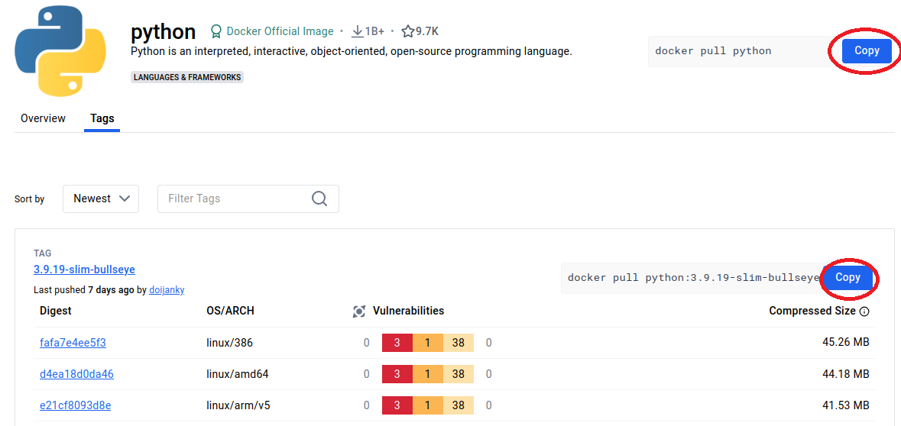

# Laboratorio 2.1 - La mejor página del mundo

>Al finalizar esta actividad, usted habrá conteinerizado una página web estática.

### Archivos a usar en esta actividad:
- `index.html`: El código de la página que vamos a servir.
- `Dockerfile`: Archivo Dockerfile con las instrucciones para armar la imaǵen.


## 1. Explorar Dockerhub:

En este ejercicio práctico exploraremos la registry de Docker Hub para buscar imágenes.

### Acceda desde su navegador web al sitio <a href="https://hub.docker.com/" target="_blank">Docker Hub</a>
En la barra de búsqueda escriba `python`


Haga click en `python`


#### Explore el Overview
El Overview es una pequeña documentación para ver qué hace la imágen, como se usa y recomendaciones.


#### Explore los tags


De esa manera puede buscar que tags hay disponibles para su imágen que quiera descargar.


## 2. Descargar una imágen

Haga click en el botón "Copy" de la imágen o bien del tag seleccionado. Verá que quedará en el portapapeles el comando.



Luego vamos a una terminal y pegamos el comando copiado. En este caso de ejemplo será la imágen `python:3.9.19-alpine3.20`.

```bash
docker pull python:3.9.19-alpine3.20
```

Eso descargará la imágen de `Python 3.9.19` usando como base la imágen `alpine3.20`.

```bash
$ docker pull python:3.9.19-alpine3.20
3.9.19-alpine3.20: Pulling from library/python
c6a83fedfae6: Pulling fs layer
c430fb000139: Pulling fs layer
8869f56a453a: Pulling fs layer
f1f123496ad3: Pulling fs layer
fb800bab7c10: Pulling fs layer
f1f123496ad3: Waiting
fb800bab7c10: Waiting
c6a83fedfae6: Verifying Checksum
c6a83fedfae6: Download complete
c430fb000139: Download complete
c6a83fedfae6: Pull complete
f1f123496ad3: Verifying Checksum
f1f123496ad3: Download complete
8869f56a453a: Download complete
fb800bab7c10: Verifying Checksum
fb800bab7c10: Download complete
c430fb000139: Pull complete
8869f56a453a: Pull complete
f1f123496ad3: Pull complete
fb800bab7c10: Pull complete
Digest: sha256:3beee521e2eec6a3a9ba0c2fdac1bf30969e7f275e379f5b0dd8b45b25f50955
Status: Downloaded newer image for python:3.9.19-alpine3.20
docker.io/library/python:3.9.19-alpine3.20

```


## 3. Comprobar que la imágen se encuentre descargada

Utilizaremos el comando para listar imágenes, `docker images`.

```bash
$ docker images
REPOSITORY    TAG                 IMAGE ID       CREATED        SIZE
python        3.9.19-alpine3.20   f214f2d92214   3 weeks ago    47.7MB

```