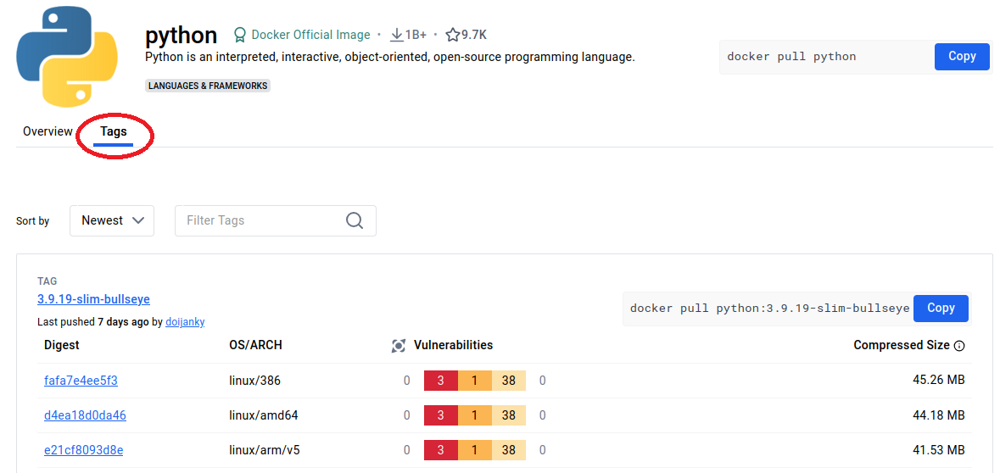

# Laboratorio 2.1 - La mejor página del mundo

>Al finalizar esta actividad, usted habrá conteinerizado una página web estática.

### Archivos a usar en esta actividad:
- `index.html`: El código de la página que vamos a servir.
- `Dockerfile`: Archivo Dockerfile con las instrucciones para armar la imaǵen.


## 1. Explorar Dockerhub:

En este ejercicio práctico exploraremos la registry de Docker Hub para buscar imágenes.

### Acceda desde su navegador web al sitio <a href="https://hub.docker.com/" target="_blank">Docker Hub</a>
En la barra de búsqueda escriba `python`


Haga click en `python`


Explore el Overview que será una referencia rápida con instrucciones y documentación sobre las imágenes


Explore los tags



De esa manera puede buscar que tags hay disponibles para su imágen que quiera descargar.


## 2. Descargar una imágen

Elija una imágen desde los tags, verá que tiene un botón que dice "Copy" que le permitirá copiar el comando para poder descargar la imágen correspondiente al tag deseado.

Vamos a una terminal y escriba lo siguiente:

```bash
docker pull docker pull python:3.9.19-alpine3.20
```

Eso descargará la imágen de `Python 3.9.19` usando como base la imágen `alpine3.20`.


```bash
docker build . -t best-page
```
Eso generará la imágen Docker, llamada `best-page`.

## 3. Verificar que la imágen fue creada

Verificar que la imágen fue creada con el comando `docker images`

```bash
docker images

REPOSITORY                    TAG       IMAGE ID       CREATED          SIZE
best-page                     latest    b77f72c4c183   4 minutes ago    125MB 
```

:ok_hand: ¡Perfecto! La imágen ha sido creada.

## 4. Correr el contenedor:

```bash
docker run -d -p 80:80 best-page
```

En este caso, se le manda parámetros a `docker run`:
- `-d`: Indica que el contenedor se ejecutará como *daemon*.
- `-p`: Indica que se publicarán puertos hacia afuera del contenedor. En este caso, `80:80` mapea el puerto 80 de nuestra PC al puerto 80 del contenedor.

## 5. Verificar que el contenedor esté corriendo

Ejecutar el comando `docker ps`

```bash
docker ps

CONTAINER ID   IMAGE       COMMAND                  CREATED         STATUS         PORTS                               NAMES
ea914d8b91b3   best-page   "nginx -g 'daemon of…"   5 seconds ago   Up 5 seconds   0.0.0.0:80->80/tcp, :::80->80/tcp   funny_elgamal
```

## 6. Comprobar el funcionamiento

Ingrese a un navegador y escriba en la dirección [localhost](http://localhost)


---------------

