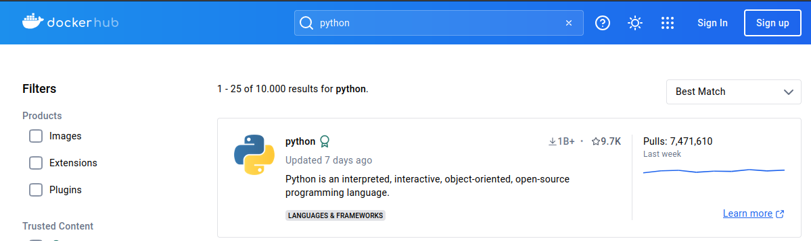
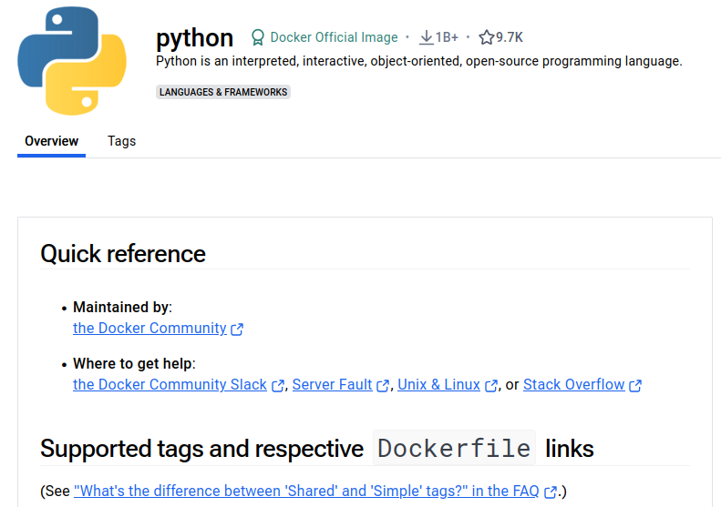
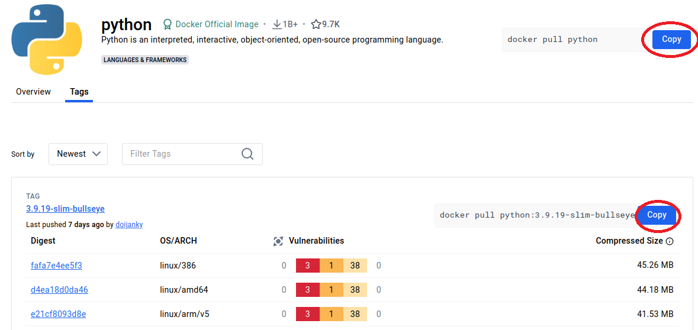

# Laboratorio 2.1 - Imágenes, registry y contenedores

### ObjetivoS:
- Entender la diferencia entre imágen y contenedor.
- Introducción a comandos básicos para gestión de imágenes y contenedores


## 1. Explorar Dockerhub:

En este ejercicio práctico exploraremos la registry de Docker Hub para buscar imágenes.

#### Acceda desde su navegador web al sitio <a href="https://hub.docker.com/" target="_blank">Docker Hub</a>
En la barra de búsqueda escriba `python`


#### Haga click en `python`



#### Explore el Overview
El Overview es una referencia rápida para ver qué hace la imágen, como se usa y recomendaciones.



#### Explore los tags


De esa manera podremos buscar entre los tags, la imágen que mejor se adapte a nuestras necesidades.


## 2. Descargar una imágen

Haga click en el botón "Copy" de la imágen o del tag seleccionado. Verá que quedará en el portapapeles el comando.



Luego vamos a una terminal y pegamos el comando copiado. En este caso de ejemplo será la imágen `python:3.9.19-alpine3.20`.

```bash
docker pull python:3.9.19-alpine3.20
```

Eso descargará la imágen de `Python 3.9.19` usando como base la imágen `alpine3.20`.

```bash
$ docker pull python:3.9.19-alpine3.20
3.9.19-alpine3.20: Pulling from library/python
c6a83fedfae6: Pulling fs layer
c430fb000139: Pulling fs layer
8869f56a453a: Pulling fs layer
f1f123496ad3: Pulling fs layer
fb800bab7c10: Pulling fs layer
f1f123496ad3: Waiting
fb800bab7c10: Waiting
c6a83fedfae6: Verifying Checksum
c6a83fedfae6: Download complete
c430fb000139: Download complete
c6a83fedfae6: Pull complete
f1f123496ad3: Verifying Checksum
f1f123496ad3: Download complete
8869f56a453a: Download complete
fb800bab7c10: Verifying Checksum
fb800bab7c10: Download complete
c430fb000139: Pull complete
8869f56a453a: Pull complete
f1f123496ad3: Pull complete
fb800bab7c10: Pull complete
Digest: sha256:3beee521e2eec6a3a9ba0c2fdac1bf30969e7f275e379f5b0dd8b45b25f50955
Status: Downloaded newer image for python:3.9.19-alpine3.20
docker.io/library/python:3.9.19-alpine3.20

```


## 3. Comprobar que la imágen se encuentre descargada

Utilizaremos el comando para listar imágenes, `docker images`.

```bash
$ docker images
REPOSITORY    TAG                 IMAGE ID       CREATED        SIZE
python        3.9.19-alpine3.20   f214f2d92214   3 weeks ago    47.7MB

```

## 4. Correr un contenedor utilizando la imágen descargada

Ahora intentaremos ejecutar un contenedor, escriba los comandos correspondientes:

```bash
$ docker run python:3.9.19-alpine3.20

# No ha pasado nada?
```

Verifiquemos si existen contenedores corriendo:

```docker
$ docker ps
CONTAINER ID   IMAGE     COMMAND   CREATED   STATUS    PORTS     NAMES

# No hay ningún contenedor listado
```

Listaremos TODOS los contenedores:

```bash
docker ps -a
CONTAINER ID   IMAGE                      COMMAND     CREATED         STATUS                     NAMES
1cda120fa6c1   python:3.9.19-alpine3.20   "python3"   2 minutes ago   Exited (0) 2 minutes ago   unruffled_moser

```

#### Qué ha pasado

Los contenedores corren la imágen correspondientes y una vez que finalizan su ejecución, terminan. En este caso, veremos que el contenedor está en estado `Exited (0)`. Eso quiere decir que terminó sin errores.

El contenedor ejecutó el ejecutable de su imágen `python3` (ver COMMAND), pero ha terminado al no tener algún archivo python para procesar o una sesión interactiva para el intérprete . Vamos a probar ejecutando una sesión interactiva a la shell de Python.

```bash
docker run -it python:3.9.19-alpine3.20

Python 3.9.19 (main, Jul 22 2024, 23:09:15)
[GCC 13.2.1 20240309] on linux
Type "help", "copyright", "credits" or "license" for more information.
>>> print("Hola Curso")
Hola Curso
>>>
```

💡 _Con el parámetro `-it` enviado a `docker run` ejecutaremos una sesión interactiva._

**¡Excelente!**. Hemos podido ejecutar un shell de Python sin tener que instalar Python en nuestra PC y usando Docker.

## 5. Verifiquemos que el contenedor esté corriendo correctamente

Abra otra ventana de la terminal PowerShell o Bash.

```powershell
docker ps
CONTAINER ID   IMAGE                      COMMAND     CREATED         STATUS         PORTS     NAMES
f31d11fefb76   python:3.9.19-alpine3.20   "python3"   6 seconds ago   Up 5 seconds             upbeat_murdock
```

Ahora podemos ver que hay un contenedor corriendo, levantado hace 5 segundos en mi caso.

Observemos mas detenidamente el output de `docker ps`:

- `CONTAINER ID`: Será el ID del contenedor. Se trata de un hash que identifica al contenedor de forma única.
- `IMAGE`: La imágen que está corriendo el contenedor.
- `COMMAND`: El comando que ejecutó la imágen. En este caso, `python3`.
- `CREATED`: El tiempo que hace que el contenedor fue creado.
- `STATUS`: Estado del contenedor
- `PORTS`: Los puertos que el contenedor escucha y los puertos del host que son redireccionados al contenedor. Lo veremos mas adelante cuando trabajemos contenedores que interactúen mediante red.
- `NAMES`: Son los nombres de los contenedores. Es otra forma de identificarlo además del ID. En este caso, como no especificamos el nombre del contenedor, Docker asigna un nombre aleatorio.


Para salir del intérprete de Python, vuelva a la terminal que está ejecutando la sesión interactiva y escriba `exit()`.

## 6. Imágenes y contenedores

Volvamos a listar los contenedores en ejecución:

```bash
docker ps
CONTAINER ID   IMAGE     COMMAND   CREATED   STATUS    PORTS     NAMES

# Ningún contenedor corriendo
```

Listemos ahora, todos los contenedores:

```bash
docker ps -a
CONTAINER ID   IMAGE                      COMMAND     CREATED       STATUS                          PORTS     NAMES
f31d11fefb76   python:3.9.19-alpine3.20   "python3"   2 hours ago   Exited (0) About a minute ago             upbeat_murdock
880b61430dcc   python:3.9.19-alpine3.20   "python3"   2 hours ago   Exited (0) 2 hours ago                    condescending_shannon
1cda120fa6c1   python:3.9.19-alpine3.20   "python3"   2 hours ago   Exited (0) 2 hours ago                    unruffled_moser
b2aa6f190df5   ubuntu                     "bash"      3 days ago    Exited (0) 3 days ago                     goofy_mcclintock
```

Vemos todos los contenedores que fueron levantados o creados en algún momento y ahora están en un status de `Exit`. Esto quiere decir que los contenedores están sin ejecutarse.
Es posible volver a levantarlos con `docker start <ID> o <NAME>`. Pero en estos casos, como es necesaria de una sesión interactiva para mantenerlos en ejecución, será necesario agregar el parámetro `-i` o `--interactive` para que se mantenga corriendo:

```bash
docker start -i f31

Python 3.9.19 (main, Jul 22 2024, 23:09:15)
[GCC 13.2.1 20240309] on linux
Type "help", "copyright", "credits" or "license" for more information.
>>>

```

💡 _Con el comando `docker start -i f31` alcanzó solo con indicando **parte del hash ID** para que Docker identificara el contenedor a iniciar. Esto es una ayuda que tenemos para simplificar los comandos; es posible con solo parte del hash ejecutar las instrucciones, tanto para arrancar (`start`) el contenedor, detenerlo (`stop`), borrarlo (`rm`), etc. También la misma lógica aplica para imágenes, redes, etc._


Corroboramos desde la otra terminal:

```bash
docker ps
CONTAINER ID   IMAGE                      COMMAND     CREATED       STATUS          PORTS     NAMES
f31d11fefb76   python:3.9.19-alpine3.20   "python3"   2 hours ago   Up 42 seconds             upbeat_murdock

```


## 7. Deteniendo contenedores

Desde esta ventana de terminal vamos a detener el contenedor con ID `f31d11fefb76` y NAME `upbeat_murdock`.

```bash
docker stop upbeat_murdock  # Comando ejecutado
upbeat_murdock              # Valor devuelto por Docker. Indicando el/los contenedores detenidos
```

Observe que en la primer terminal, ya no estará sobre la Shell de Python y el prompt volvió a la terminal PowerShell o Bash, indicando que el contenedor se ha detenido.

```bash
CONTAINER ID   IMAGE                      COMMAND     CREATED       STATUS                       PORTS     NAMES
f31d11fefb76   python:3.9.19-alpine3.20   "python3"   4 hours ago   Exited (137) 5 minutes ago             upbeat_murdock
```

Observe que ahora cambia el código de Exit (137). Que indica que el contenedor termina por un SIGKILL.


## 8. Eliminando contenedores

Si seguimos haciendo pruebas, de levantar contenedores y bajarlos constantemente tendremos una lista de contenedores en estado de `Exit que tal vez no deseamos tener.

Se utiliza el comando `docker rm <ID>|<NAME>`.

```bash
# Primero listamos los contenedores existentes

docker ps -a

CONTAINER ID   IMAGE                      COMMAND     CREATED       STATUS                     NAMES
f31d11fefb76   python:3.9.19-alpine3.20   "python3"   4 hours ago   Exited (137) 2 hours ago   upbeat_murdock
880b61430dcc   python:3.9.19-alpine3.20   "python3"   4 hours ago   Exited (0) 4 hours ago     condescending_shannon
1cda120fa6c1   python:3.9.19-alpine3.20   "python3"   4 hours ago   Exited (0) 4 hours ago     unruffled_moser
b2aa6f190df5   ubuntu                     "bash"      3 days ago    Exited (0) 3 days ago      goofy_mcclintock

# Eliminamos el contenedor upbeat_murdock

docker rm upbeat_murdock
upbeat_murdock              # Retorna el contenedor eliminado

docker ps -a
CONTAINER ID   IMAGE                      COMMAND     CREATED       STATUS                   PORTS     NAMES
880b61430dcc   python:3.9.19-alpine3.20   "python3"   4 hours ago   Exited (0) 4 hours ago             condescending_shannon
1cda120fa6c1   python:3.9.19-alpine3.20   "python3"   4 hours ago   Exited (0) 4 hours ago             unruffled_moser
b2aa6f190df5   ubuntu                     "bash"      3 days ago    Exited (0) 3 days ago              goofy_mcclintock

# Ya no existe el contenedor upbeat_murdock
```

El comando `docker rm` puede ir acompañado por el ID completo o parcial.


#### Iniciar un contenedor y luego se borre automáticamente

Si agregamos el parámetro `--rm`, nuestro contenedor se eliminará automáticamente al cerrarse.

```bash
docker run -it --rm --name contenedor_prueba python:3.9.19-alpine3.20 # Le asignamos un nombre al contenedor

Python 3.9.19 (main, Jul 22 2024, 23:09:15)
[GCC 13.2.1 20240309] on linux
Type "help", "copyright", "credits" or "license" for more information.
>>> exit()

docker ps -a

CONTAINER ID   IMAGE                      COMMAND     CREATED       STATUS                     NAMES
880b61430dcc   python:3.9.19-alpine3.20   "python3"   4 hours ago   Exited (0) 4 hours ago     condescending_shannon
1cda120fa6c1   python:3.9.19-alpine3.20   "python3"   4 hours ago   Exited (0) 4 hours ago     unruffled_moser
b2aa6f190df5   ubuntu                     "bash"      3 days ago    Exited (0) 3 days ago      goofy_mcclintock
```


## 9. Eliminar imágenes

Primero listemos las imágenes que tenemos descargadas:

```bash
docker images

REPOSITORY    TAG                 IMAGE ID       CREATED        SIZE
python        3.9.19-alpine3.20   f214f2d92214   3 weeks ago    47.7MB
ubuntu        latest              35a88802559d   8 weeks ago    78.1MB
```
Intentemos eliminar la imágen de Python

```bash
docker rmi f214f        # Comando para eliminar + parcial hash

Error response from daemon: conflict: unable to delete f214f2d92214 (must be forced) - image is being used by stopped container 1cda120fa6c1
```

Nos indica que no fue posible eliminar la imágen, ya que está siendo usada por el contenedor detenido con ID `1cda120fa6c1`.

Tenemos dos opciones.
1. Eliminar primero el o los contenedores que la están utilizando y luego borrar la imágen.
2. Eliminar la imágen de forma forzada. De esta forma quedarán contenedores indicando la imágen con ID. Algunas veces no será posible ejecutar dichos contenedores después.


```bash
docker rmi --force f214f
Untagged: python:3.9.19-alpine3.20
Untagged: python@sha256:3beee521e2eec6a3a9ba0c2fdac1bf30969e7f275e379f5b0dd8b45b25f50955
Deleted: sha256:f214f2d92214f673c96aa471957456460d1e8a2b390ebfbf43895ca5c9ab093e

docker ps -a
CONTAINER ID   IMAGE          COMMAND     CREATED       STATUS                   PORTS     NAMES
880b61430dcc   f214f2d92214   "python3"   4 hours ago   Exited (0) 4 hours ago             condescending_shannon
1cda120fa6c1   f214f2d92214   "python3"   4 hours ago   Exited (0) 4 hours ago             unruffled_moser
b2aa6f190df5   ubuntu         "bash"      3 days ago    Exited (0) 3 days ago              goofy_mcclintock
```


## Referencias

- <a href="https://docs.docker.com/reference/cli/docker/container" target="_blank">docker container commands</a>

- <a href="https://docs.docker.com/reference/cli/docker/image/pull/" target="_blank">docker pull</a>
- <a href="https://docs.docker.com/reference/cli/docker/image/ls/" target="_blank">docker images</a>
- <a href="https://docs.docker.com/reference/cli/docker/container/ls/" target="_blank">docker ps</a>
- <a href="https://docs.docker.com/reference/cli/docker/container/start/" target="_blank">docker start</a>
- <a href="https://docs.docker.com/reference/cli/docker/container/stop/" target="_blank">docker stop</a>
- <a href="https://docs.docker.com/reference/cli/docker/container/rm/" target="_blank">docker rm</a>

