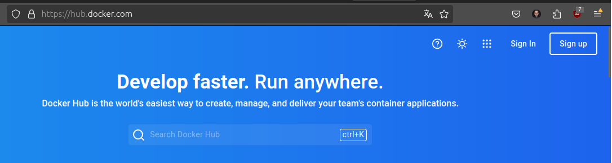
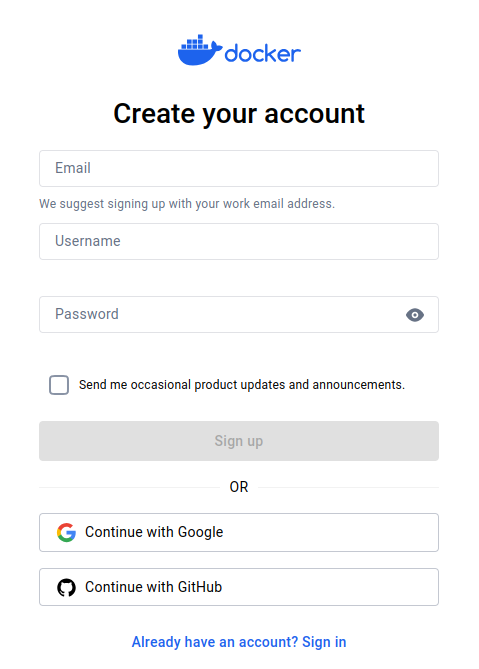
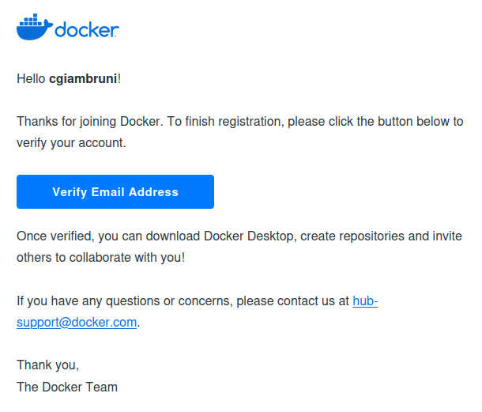
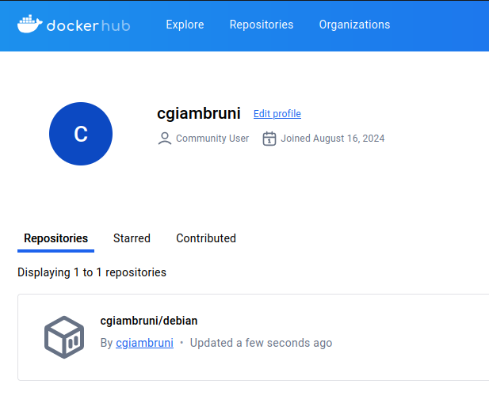
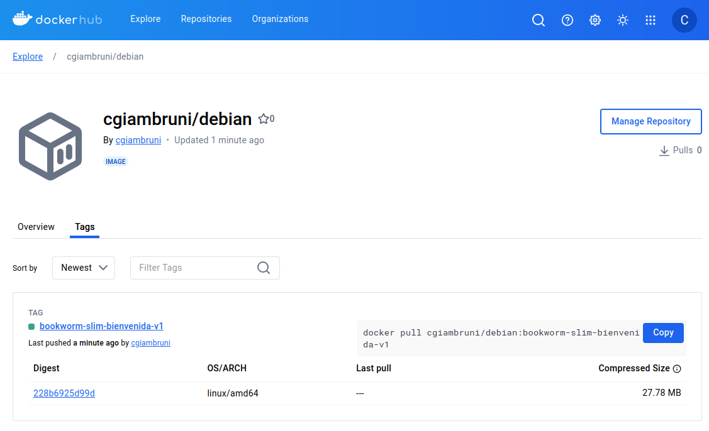

# Laboratorio 2.3: Guardando imágenes en DockerHub

## Objetivos:
- Guardar nuestras imágenes en Dockerhub
- Compartir nuestras imágenes
- Conceptos de login y logout

>**Importante:** ⚠️ El siguiente Lab ha sido probado enteramente usando Docker CLI. Puede ser que en Docker Desktop algún paso pueda diferir ligeramente en la sección de login.

##  Crear cuenta en DockerHub

### 1. Preparando nuestra registry

1. **Accedemos a DockerHub**

    Elegimos "Sign Up" para crear una cuenta.

    

2. **Creamos una cuenta**

    Elegimos un e-mail, un nombre de usuario y una contraseña.

    

3. **Nos llegará un mail para confirmar la cuenta**

    

    Confirmemos con el link y accedamos a DockerHub.

4. **Accedemos a DockerHub**

    En la opción "My Profile" podemos listar nuestros repositorios. Como he creado la cuenta recién, no habrá nada que mostrar.

    


## Preparando una imágen para subir

### 1. Modificar una imágen Debian

1. **Ejecuta el siguiente comando para correr un contenedor basado en la imagen de Debian 12:**

    ```bash
    docker pull debian:bookworm-slim
    ```

2. **Una vez descargada la imágen, la ejecutamos con `docker run`:**

    ```bash
    docker run -it --name debian12 debian:bookworm-slim bash
    # Le agregamos --name solamente para poder identificar el contenedor
    ```

3. **Una vez dentro del contenedor vamos a hacer un cambio en la imágen**

    Solo para hacer alguna modificación menor, ejecute el siguiente comando: `echo "echo ESCRIBA UN MENSAJE" >> ~/.bashrc`

    ```bash
    echo "echo Bienvenido a mi Debian personalizado" >> ~/.bashrc
    ```

    En mi caso, coloqué el mensaje _Bienvenido a mi Debian personalizado_. Tal comando solamente mostrará ese mensaje cada vez que inicie una sesión interactiva en el contenedor. Puede mostrar el mensaje que usted quiera.

4. **Salir del contenedor escribiendo:**

    ```bash
    exit
    ```

### 2. Crear una nueva versión de la imágen

Tal como hicimos en el laboratorio anterior, vamos a hacer una nueva versión de la imágen Debian que incluye nuestro cambio de mensaje de bienvenida.

1. **Listemos contenedores:**
    
    Ejecutemos el comando `docker ps -al`.

    La `l` adicional nos mostrará los contenedores mas recientes. Eso es útil principalmente si hemos realizado numerosas pruebas en nuestro sistema y contamos con un gran número de contenedores.

    ```bash
    $ docker ps -al

    CONTAINER ID   IMAGE                  COMMAND   CREATED         STATUS                          PORTS     NAMES
    07b33b71543d   debian:bookworm-slim   "bash"    3 minutes ago   Exited (0) About a minute ago             debian12

    ```

2. **Guardaremos nuestra nueva imágen:**

    ```bash
    docker commit debian12 debian:bookworm-slim-bienvenida-v1
    ```

3. **Verifica que la nueva imagen se haya creado:**

    ```bash
    docker images

    REPOSITORY   TAG                            IMAGE ID       CREATED              SIZE
    debian       bookworm-slim-bienvenida-v1    c0cbc2d00e65   About a minute ago   74.8MB
    debian       bookworm-slim                  4735ff618e63   3 days ago           74.8MB
    ```

4. **Verifiquemos que realmente la imágen hace lo que debería:**
    
    Ejecutamos `docker run --rm -it debian:bookworm-slim-bienvenida-v1 bash`

    ```bash
    $ docker run --rm -it debian:bookworm-slim-bienvenida-v1 bash
    Bienvenido a mi Debian personalizado
    root@a28bff1ff75f:/# 
    ```

    Si la salida es como la mostrada anteriormente, entonces todo ha salido bien.

    Salimos del contenedor con el comando `exit`.


### 3. Subimos a la registry

1. **Preparando la imaǵen:**

    Antes de subir la imágen a una registry pública como DockerHub, es necesario hacer un nuevo tag, ya que deberá ser posible identificar unívocamente la imágen del resto de las imágenes públicas. Por eso, hay que especificar nuestro usuario de DockerHub que hemos creado en el punto 1.

    Ejecutamos el siguiente comando `docker image tag <IMAGE:TAG> <DOCKER_HUB_USER>/<IMAGE>:<TAG>`. En mi caso como mi user es cgiambruni, el comando quedaría de la siguiente manera:

    ```bash
    docker image tag debian:bookworm-slim-bienvenida-v1 cgiambruni/debian:bookworm-slim-bienvenida-v1
    ```

2. **Cargamos nuestras credenciales:**

    Para poder subir las imágenes necesitamos cargar las credenciales de DockerHub en nuestra computadora.

    En la Docker CLI puede hacerse con el comando `docker login`:

    ```bash
    Username: cgiambruni
    Password: ********************

    Login Succeeded
    ```

3. **Subir nuestra imágen:**

    Una vez que las credenciales fueran cargadas con éxito, subiremos las imágenes con el comando `docker push`:

    ```bash
    docker push cgiambruni/debian:bookworm-slim-bienvenida-v1 
    The push refers to repository [docker.io/cgiambruni/debian]
    5f57f2d5fca8: Pushed 
    9853575bc4f9: Mounted from library/debian 
    bookworm-slim-bienvenida-v1: digest: sha256:228b6925d99d1673e9ceec3ff6763152d105ba2a6a26eae233a2c324f4e59f9f size: 736

    ```

4. **Corroboramos que la imágen haya subido a nuestro repositorio:**

    Abrimos nuevamente DockerHub en "My Profile". Si todo salió bien, debería aparecer algo similar a la imágen:

    

    Si hacemos clic en el repositorio y luego en _Tags_ deberíamos ver lo siguiente:

    


## 4. Descargue la imágen de otro alumno/a

Para concluir, probemos el mensaje que le ha puesto nuestro compañero o compañera de curso. Pídale a alguien que le pase la ruta de su imágen para poder ver su mensaje.

Ejecute el comando `docker run --rm -it <USUARIO>/<IMAGE>:<TAG>`. En mi caso será:

```bash
$ docker run -it --rm cgiambruni/debian:bookworm-slim-bienvenida-v1 bash
Bienvenido a mi Debian personalizado
```

Salga del contenedor con el comando `exit`.
    
## 5. Cerrar sesión de la registry

Antes de finalizar cerremos sesión con el comando `docker logout`.

```bash
$ docker logout
Removing login credentials for https://index.docker.io/v1/

```


## Referencias

- <a href="https://docs.docker.com/reference/cli/docker/container/commit/" target="_blank">docker commit</a>
- <a href="https://docs.docker.com/reference/cli/docker/image/push/" target="_blank">docker push</a>
- <a href="https://docs.docker.com/reference/cli/docker/login/" target="_blank">docker login</a>
- <a href="https://docs.docker.com/reference/cli/docker/logout/" target="_blank">docker logout</a>


