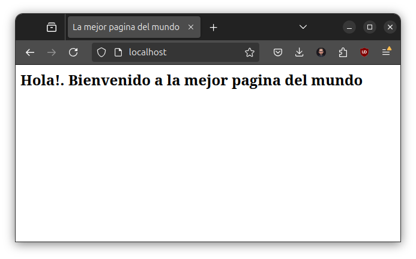

# Laboratorio 3.2 - La mejor página del mundo

## Objetivos
- Conteinerizar una página web estática.
- Publicar puertos y poder acceder al contenedor desde nuesta PC.
- Seguir analizando y entendiendo conceptos de `Dockerfiles`.

### Archivos a usar en esta actividad:
- `index.html`: El código de la página que vamos a servir. 
- `Dockerfile`: Archivo Dockerfile con las instrucciones para armar la imaǵen.


## 1. Analizar el archivo `Dockerfile`:

```dockerfile
# Imágen base
FROM ubuntu:latest

# Ejecuto actualización de repositorios e instalo el servidor web nginx
RUN apt-get update && apt-get install -y nginx

# Copio el archivo index para que sea visible desde el nginx del contenedor
COPY index.html /var/www/html/

# Comando a ejecutar
CMD ["nginx", "-g", "daemon off;"]

# Expongo el puerto 80
EXPOSE 80
```

Según podemos ver, arrancamos de una imágen base Ubuntu. Sin nada instalado. Así que, se procede a actualizar la base de repositorios con `apt-get update` y luego instalamos nginx con `apt-get install nginx`.

En la capa 3, se copia el archivo `index.html` a la ruta `/var/www/html` que es la ruta por defecto donde nginx almacena los archivos.

## 2. Crear la imaǵen

Ejecutar:

```bash
docker build . -t best-page
```
Eso generará la imágen Docker, llamada `best-page`.

## 3. Verificar que la imágen fue creada

Verificar que la imágen fue creada con el comando `docker images`

```bash
docker images

REPOSITORY                    TAG       IMAGE ID       CREATED          SIZE
best-page                     latest    b77f72c4c183   4 minutes ago    125MB 
```

:ok_hand: ¡Perfecto! La imágen ha sido creada.

## 4. Correr el contenedor:

```bash
docker run -d -p 80:80 best-page
```

En este caso, se le manda parámetros a `docker run`:
- `-d`: Indica que el contenedor se ejecutará como *daemon*.
- `-p`: Indica que se publicarán puertos hacia afuera del contenedor. En este caso, `80:80` mapea el puerto 80 de nuestra PC al puerto 80 del contenedor.

## 5. Verificar que el contenedor esté corriendo

Ejecutar el comando `docker ps`

```bash
docker ps

CONTAINER ID   IMAGE       COMMAND                  CREATED         STATUS         PORTS                               NAMES
ea914d8b91b3   best-page   "nginx -g 'daemon of…"   5 seconds ago   Up 5 seconds   0.0.0.0:80->80/tcp, :::80->80/tcp   funny_elgamal
```

## 6. Comprobar el funcionamiento

Ingrese a un navegador y escriba en la dirección [localhost](http://localhost)



## Mejorar archivo

Para este ejercicio usamos una imágen base `ubuntu` y luego hemos instalado `nginx`. Siempre que sea posible, optaremos por buscar las imágenes base que mas cerca estén de nuestra aplicación. Es decir, en vez de bajar una imágen `ubuntu` y luego instalar `nginx` lo mejor es bajar directamente una imágen `nginx`.

Podemos buscar las imágenes con el comando `search`

```bash
docker search nginx
```

O bien desde Docker Hub buscamos la imágen de <a href="https://hub.docker.com/_/nginx" target="_blank">nginx</a> con el tag que mejor se adapte a nuestras necesidades.


Vamos a elegir la siguiente imágen: `nginx:stable-alpine3.19` y cambiar el Dockerfile

```dockerfile
# Imágen base
FROM nginx:stable-alpine3.19

# Copio el archivo index para que sea visible desde el nginx del contenedor
# La ruta cambia porque alpine por defecto cambia la ruta.
COPY index.html /usr/share/nginx/html

# Expongo el puerto 80
EXPOSE 80

```

### Volvemos a buildear la imágen

```bash
docker build . -t best-page:alpine

```

### Corremos el contenedor

```bash
docker run -d -p 80:80 best-page:alpine
```

---------------

