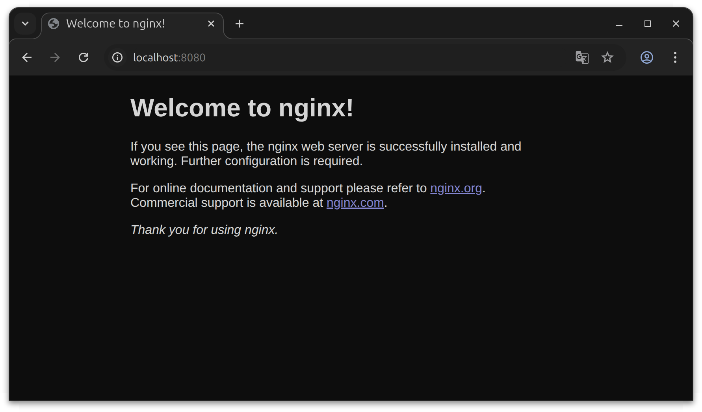
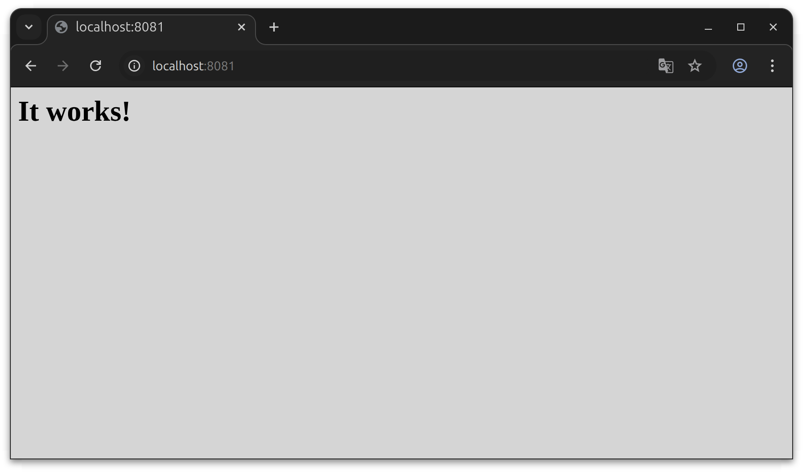

# Laboratorio 4.3 - Puertos y redirecciones

## Objetivo
Comprender el uso correcto de redirección de los puertos en contenedores


## 1. Crear una red bridge nueva:

- Crea una red bridge `web_apps`
- Para eso haremos uso del comando `docker network create web_apps`

    ```bash
    docker network create web_apps
    ```

## 2. Levantar un contenedor en el puerto 8080

- Crear un contenedor `nginx` que escuche en puerto `8080`:

    ```bash
    docker run -d --rm --name nginx -p 8080:80 nginx
    ```
- Verificar que la app esté arriba: <a href="http://localhost:8080" target="_blank" rel="noopener noreferrer">localhost:8080</a>

Deberías ver la ventana de bienvenida de Nginx



## 3. Levantar otro servidor web:

- Vamos a levantar otro servidor web. Esta vez usaremos una imágen de `Apache`.

```bash
docker run -d --rm --name apache -p 8080:80 httpd
```

> [!IMPORTANT]  
> NO FUNCIONA. ¿Qué ha pasado? Analicemos el error:

```bash
docker: Error response from daemon: failed to set up container networking: driver failed programming external connectivity on endpoint apache
: Bind for 0.0.0.0:8080 failed: port is already allocated
```

Lo importante acá es saber que **port is already allocated**. Es decir, que el puerto está utilizado. Pero... ¿Cuál es el puerto que ya está siendo utilizado?... es el puerto del host. Es decir, el primer argumento del `-p`. En este caso, el `8080`.

Ambos contenedores podrían escuchar internamente el puerto `80` pero es importante que el puerto del host no esté utilizado.

## 4. Inspeccionar la red

- Cambiemos el puerto del host que es redireccionado al contenedor

    ```bash
    docker run -d --rm --name apache -p 8081:80 httpd
    ```
- El contenedor debería levantar. Prueba acceder <a href="http://localhost:8081" target="_blank" rel="noopener noreferrer">localhost:8081</a>
- Deberías poder ver la pantalla de OK de Apache




## 5. Detener contenedores y eliminar red

- Detenemos contenedores. Al detenerlo, se eliminarán ya que los hemos levantado con el parámetro `--rm`.

    ```bash
    docker stop apache nginx
    ```
- Eliminamos la red creada

    ```bash
    docker netork rm web_apps
    ```
--------

<p align="center">
  
</p>
